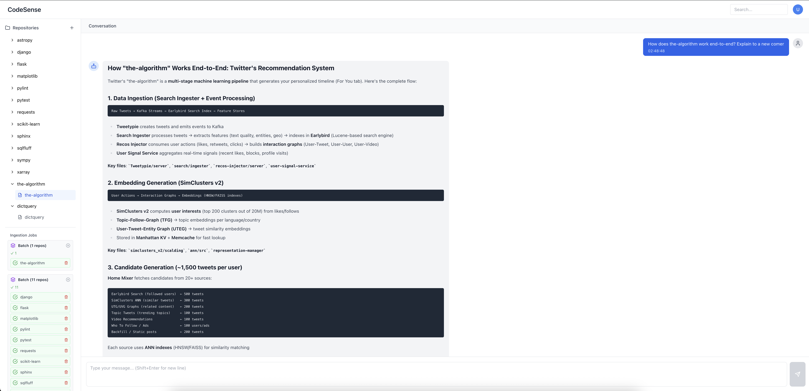

# **CodeSense — Repo-wide QA engine**

> **Goal:** Build a repo-wide code understanding system that provides **accurate, evidence-grounded answers developers can rely on especially on large code repositories**.

Repo-wide code question answering is typically approached using **RAG** (retrieve top-k snippets) and/or **agentic traversal** (search → read → repeat). These methods give the model a **partial view** of the codebase and often struggle with cross-file reasoning and global structure.

CodeSense takes a different approach.

> **CodeSense treats repo QA as a compression problem, not a search problem.**

Instead of retrieving isolated snippets, CodeSense:

* scans and classifies source files directly from the repository,
* compresses file-level signals into a **global repository context** that fits within an LLM’s context window. For example: [Astropy on GitHub](https://github.com/astropy/astropy) (~1M Python tokens) is compressed by CodeSense to ~48k tokens.
* and uses this context to answer questions with a **repo-wide mental model**.

> Note: The repo-wide mental model is constructed exclusively from source code and does not rely on repository documentation or Markdown files.

The resulting mental model captures the repository’s important files, responsibilities, and likely relationships across components, enabling reliable reasoning about the broader codebase.

Importantly, this mental model serves two roles:

1. **Answering**: the LLM can directly answer questions using a coherent global view of the repository.
2. **Navigation**: the model can also use the mental model as a navigation guide to identify *where to look* when deeper inspection is needed, rather than relying on blind retrieval.

The goal is to give the LLM an **integrated understanding of the entire codebase**, rather than a handful of retrieved chunks or an agent’s transient working memory.


> **Outcome:** In a controlled comparison against DeepWiki (Cognition), I tested repo-level understanding with and without Markdown documentation. I found that DeepWiki’s explanations rely heavily on existing docs and degrade significantly when documentation is removed. In contrast, CodeSense continues to produce coherent, end-to-end explanations because its repo-wide mental model is derived entirely from source code and repository structure, not from written documentation. This makes the system more robust to undocumented, outdated, or poorly documented repositories and better suited for reliable, code-grounded answers.

---

## How is the mental model created

1. **Scan the repository** and filter out ignored paths.
2. **Run pre-ingestion analysis** to identify supported source files, estimate token footprint, and persist supported-file state for incremental ingestion.
3. **Generate a "mental model"**: classify files (CRITICAL vs IGNORE) and summarize critical files from source code, inferring likely upstream/downstream relationships from code structure when needed.
4. **Compress to global context**: assemble a repo-wide context from critical-file summaries so it fits comfortably in the LLM context window.
5. **Answer questions** using the global context (no doc reliance required).

---

## Why this matters vs RAG/agents

* **RAG**: high recall is hard; you often miss the “glue” code, registry wiring, and multi-hop dependencies.
* **Agents**: can recover via iteration, but are slower, costlier, and still prone to partial views and drift.
* **Compression-first**: gives the model a **stable global view**, enabling more reliable cross-file reasoning.

## TL;DR
Search-based approaches inevitably expose the model to only a small subset of the repository (e.g., top-k files out of thousands). In large codebases like Twitter’s recommendation system (~6k files), this means answers are constructed from a partial view and can miss critical cross-file interactions. CodeSense instead compresses repository-wide signals into a global context, allowing questions to be answered with awareness of the broader codebase, not just a retrieved fraction.

---

## Architecture overview

**Stages**

* **Pre-ingestion analysis**: scans files, filters directories, estimates size/budget, and persists supported-file state for incremental re-ingestion.
* **Mental model generation**: uses source code plus an LLM to produce short file-level briefs and criticality labels.
* **Repo context builder**: assembles a **global repo context** from critical-file briefs, then stores it in SQLite.

**Storage**

* **SQLite**: ingestion jobs, supported-file state, file briefs, chat history, and global repo context


## Evaluation

To demonstrate the system's ability to understand complex codebases **purely from source code** (without relying on documentation, READMEs, or markdown files), I conducted a ablation test using X's open-sourced recommendation algorithm repository (`twitter/the-algorithm`, ~1M LOC in Scala, Java, python and Rust).

### DeepWiki Ablation Test (Code-Only vs. With Documentation)

I compared our tool against **DeepWiki** (Cognition Labs / Devin-powered repository documentation and QA tool) on the same challenging questions, in two modes:

1. **Full repo (with all .md/README files)** — DeepWiki's default setting  
2. **Code-only (all *.md files removed)** — simulating real-world undocumented or sparsely documented codebases

#### Question 1: "Just tell me step by step what happens when I refresh my ForYou page."

| Mode                  | DeepWiki Response Quality                                                                 | Our Tool Response Quality                                                                 |
|-----------------------|--------------------------------------------------------------------------------------------|-------------------------------------------------------------------------------------------|
| With .md files        | Comprehensive, accurate, detailed pipeline (candidate sources, ranking, mixing rules)     | N/A                                                  |
| **Code-only (no .md)**| Shallow & incomplete — missed core components (Earlybird, TweetMixer, UTEG, heavy ranker, diversity filters, feature hydration) | **Excellent** — reconstructed full flow: parallel candidate pipelines (15+ sources incl. SimClusters, UTEG, EvergreenVideos), ~30+ feature hydrators, Phoenix/Navi heavy rankers, debunching/diversity, latency breakdown, all grounded in precise file/class references |

#### Question 2: "I'm a newcomer, how does it all work?" (high-level architecture overview)

| Mode                  | DeepWiki Response Quality                                                                 | Our Tool Response Quality                                                                 |
|-----------------------|--------------------------------------------------------------------------------------------|-------------------------------------------------------------------------------------------|
| With .md files        | Solid high-level summary, but heavily derived from top-level README.md                     | N/A                                                                              |
| **Code-only (no .md)**| N/A (test not run, but expected to degrade significantly based on prior behavior)         | **Superior** — synthesized rich overview: data ingestion, candidate sources (SimClusters ANN, RealGraph, Earlybird), ML ranking (Phoenix, Navi, ClemNet), mixing heuristics (diversity, freshness, ads), serving infra (Finagle, Manhattan, Kafka), concrete ForYou flow example, scale numbers, key tech table — all inferred purely from code structure |

### Key Takeaways
- **DeepWiki** relies heavily on human-written markdown documentation for accurate high-level reasoning and architectural synthesis. When documentation is removed, its answers become shallow, incomplete, and miss critical system components.
- Our system **excels in the code-only setting** — deriving deeper, more accurate architectural understanding directly from:
  - Repository-wide source-code scanning and summarization
  - File-state-aware incremental ingestion
  - Critical file selection and source-grounded summarization
  - Repository context synthesis from summarized critical files

This demonstrates a significant advantage in real-world scenarios where documentation is sparse, outdated, or absent — a common situation in large production codebases.

I believe this is a meaningful step toward more robust, doc-independent repository-level code understanding, and plan to evaluate further on benchmarks like SWE-QA in pure code-only mode.

---

## Limitations (current)

* **Context window constraints**: CodeSense relies on fitting the compressed repo-wide mental model within the LLM’s context window. If the compressed representation exceeds the available context, this approach will not scale further without additional hierarchical compression. In practice, this design works well for most real-world repositories; for example, a ~1.2M LoC codebase (~5M raw tokens) was compressed to ~600k tokens, comfortably fitting within Grok’s 2M-token context window.
--- 

## Run Locally

### Host development workflow (recommended)

Make sure you have **`uv`** installed.

1. Install dependencies and create the virtual environment:

   ```bash
   uv sync
   source .venv/bin/activate
   ```

2. Create your local environment file:

   ```bash
   cp .env.local.example .env.local
   ```

   Then set:

   * `XAI_API_KEY`

3. Create `data/` and clone a repo to ingest. For example:

   ```bash
   mkdir -p data
   git clone https://github.com/cyberlis/dictquery.git data/dictquery
   ```

4. Run the API:

   ```bash
   uv run uvicorn app.main:app --reload
   ```

5. Verify:

   * API docs: http://localhost:8000/docs#/
   * SQLite database: `data/code_sense.sqlite3`

6. Optional UI:

   ```bash
   git clone https://github.com/bigrewal/code-sense-ui
   cd code-sense-ui
   npm install
   # Create .env.local and set VITE_API_BASE=http://localhost:8000
   npm run dev
   ```

### Docker Compose workflow

If you want to run the API in Docker instead:

```bash
cp .env.local.example .env.local
mkdir -p data
docker compose up --build
```


---

## Demo

[▶️ Watch demo](demo/demo.mov)




---

### Shutdown Services

To stop the Docker stack if you used Docker Compose:

```bash
docker compose down
```

To stop and remove volumes as well:

```bash
docker compose down -v
```

---

**Hard requirements**

* `XAI_API_KEY`
* A repository checked out under `data/`
* Optional: `SQLITE_DB_PATH` (defaults to `data/code_sense.sqlite3`)

**Endpoints**

* API: [http://localhost:8000](http://localhost:8000)
* CodeSense UI: http://localhost:5173/
